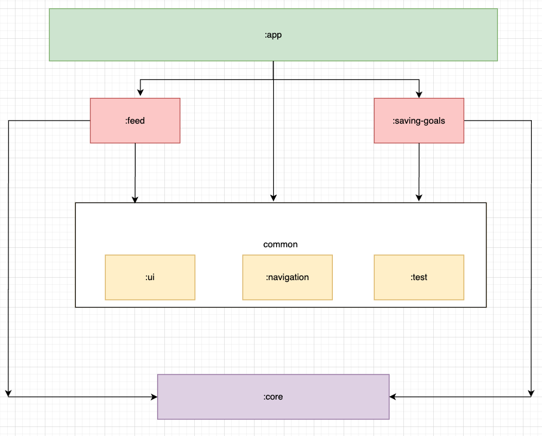

# About MyStarling app
App will take all the transactions in a given week and round them up to the nearest pound. For example with spending of £4.35, £5.20 and £0.87, the round-up would be £1.58. This amount should then be transferred into a savings goal, helping the customer save for future adventures.

https://github.com/AlexPershinCtM/MyBankingApp/assets/79848638/4d1656b4-6f0a-481e-9721-4cf98951b3b6

## Features

### Feed screen
The screen presents the most recent transactions, including details such as the merchant, date/time, and transaction amount. It manages success, empty transaction lists, and error messages. To transfer the roundup amount to a savings goal, users can click on the banner at the top of the screen. The app will then guide users to the savings goals screen, where they can choose the specific savings goal to contribute to.

### Saving goals screen
The screen exhibits a list of saving goals, showcasing details such as the goal name, total saved amount, and target. It effectively manages success messages, scenarios where there are no goals listed, and error states. Users are empowered to transfer the roundup amount to any goal or create a new saving goal by simply clicking on the designated button.

### How to build app?
Before building app you need to create your Sandbox Customer first - https://developer.starlingbank.com/sandbox/select. 
Once Sandbox Customer is created use it's data to update `local.properties` file with secrets:

- `accessToken="YOUR_STARLING_ACCESS_TOKEN` can be found in Customer Details on Sandbox page

  

- `accountUid="YOUR_STARLING_ACCOUNT_UID"` can be found in Accounts API json response on Sandbox pag
- `defaultCategory="YOUR_DEFAULT_CATEGORY"` can be found in Accounts API json response on Sandbox page

To simulate some transactions use Postman or Auto-simulator feature on the bottom of Sandbox web page.

Enjoy!

### Tech stack
- I used Single Activity Approach
- Compose for UI
- Coroutines for asynchronous operations
- Retrofit for communication with server
- Navigation between screens is handled by compose navigation library, I created small abstraction around it to be able to do navigation from ViewModel classes and be able to unit test it
- JUnit and Mockk for testing

### App architecture
- I used Clean Architecture, however I didn't create interface for every class (like mapper) because it's overkill and for small project like this it not worth it.
- For presentation layer I used MVVM
- There are different modules:
- `:app` which is entry point for MyStarling app. This module depends on `:feed` and `:saving-goals` feature modules becuase `:app` needs those features. Also it depends on `:common-ui` and `:common-navigation`. 
- `:feed` feature module depends on `:common-ui`, `:common-navigation` and `:core`.
- `:saving-goals` feature module depends on `:common-ui`, `:common-navigation` and `:core`. 
-  `:common-ui` provides UI related classes like Compose and common UI components (e.g. ElevatedCard, AlertDialog)
-  `:common-navigation` provides navigation related classes (e.g. NavigationHandler)
-  `:core` provides core dependencies to feature modules
-  `:common-test` provides classes necessary for unit and robolectric testing

##### Modules Diagram

### Any outgoing work?

I successfully included unit, espresso and Robolectric tests for all classes within the `:feed` feature. This includes tests for Repository, Mapper, Service, UseCase, ViewModel, and a Robolectric test specifically for FeedScreen. However, due to time constraints, I couldn't provide coverage for every class within the repository. It will be added soon.

Things to finish:
- Add tests for `:saving-goals` feature

### Questions or Feedback?
I would be super grateful to hear from you any questions of feedback!
